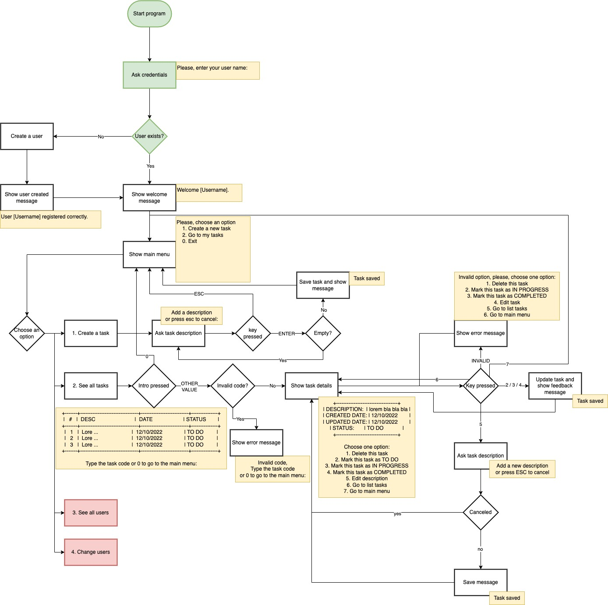

# Sprint 3.3 - TO DO Project

Aplicación que permite guardar una lista de tareas para hacer.
- Mostras las tareas e sus estados (pendentes, en progreso y hechas), hora de inicio y final, usuario que ha creado la tarea.
- Permite:
  - Crear tareas
  - Actualizar tareas
  - Borrar tareas
  - Listar todas las tareas
  - Listar una tarea determinada

## Modo de funcionamento

Para ejecutar la aplicación:

1. Instalar [Docker](https://www.docker.com/)
1. Levantar la instancia de MySQL

> `$ docker compose -f docker/docker-compose-mysql.yml up `

3. Ejecutar la app

> `$ node app/app.js `

El programa creará la base de datos y algunos datos de ejemplo automaticamente.

El programa preguntará donde quieres guardar tus datos. Actualmente solamente la opción 1 y 2 está implementada (Nivel 1 y 2). 

`Which persistence will you use?
>1. Json file in disk
>2. Mysql
>3. MongoDb
`

Después pedirá el nombre de usuario. Caso quieres ver algún usuario con dato, puedes escribir "Alex", "Marçal" o "Marc" ;)

## Flujo de datos implementado

## Futuras implementaciones

- Ver todos los usuarios
- Modificar usuarios

## Referencias utilizadas

1. [Git Flow](https://www.atlassian.com/es/git/tutorials/comparing-workflows/gitflow-workflow)
1. [Starndard JS](https://standardjs.com/)
1. [¡Tu CÓDIGO JAVASCRIPT sin ERRORES! 🛑🐛 - Configurando el LINTER con ESLint y STANDARD JS](https://www.youtube.com/watch?v=QpDpRmlFfqI)
1. [Docker](https://www.docker.com/)
1. [NPM MySQL](https://www.npmjs.com/package/mysql)

## Visual Studio Code Plugins
- [Error Lens](https://marketplace.visualstudio.com/items?itemName=usernamehw.errorlens)
- [Eslint](https://marketplace.visualstudio.com/items?itemName=dbaeumer.vscode-eslint)
- [StardardJS](https://marketplace.visualstudio.com/items?itemName=standard.vscode-standard)

## Equipo

- Cadevall Baulies, Alex (alexcadevall@gmail.com)
- Chaiben Machado, Marçal (marcal.chaiben@gmail.com)
- Gaspar, Marc (marc.gaspar.martinez@gmail.com)

<!-- 

## Documents:
- appData.json (contains):
    - User array (contains):
        - id
        - username
    - Task array (contains):
        - id
        - user_id
        - description
        - create_date
        - status
        - closed_date
- jsonFileManager.js (contains):
    - Path constructor
    - `function` Require JSON 
    - `function` Modify JSON 
- helpers.js (contains): 
    - `function` Create task 
    - `function` Update task 
    - `function` Erase task 
    - `function` Check a task 
    - `function` Check all tasks 
- app.js (contains):
    - console prompts
    - function calls
    - `function` menu (start) -->

